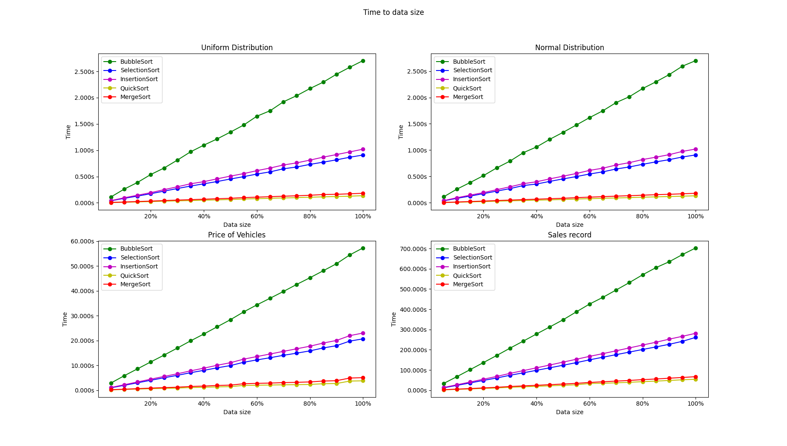
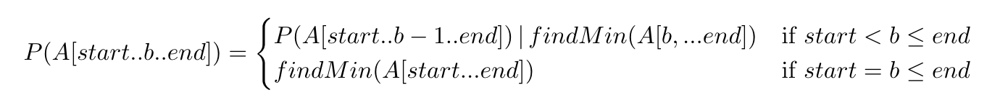
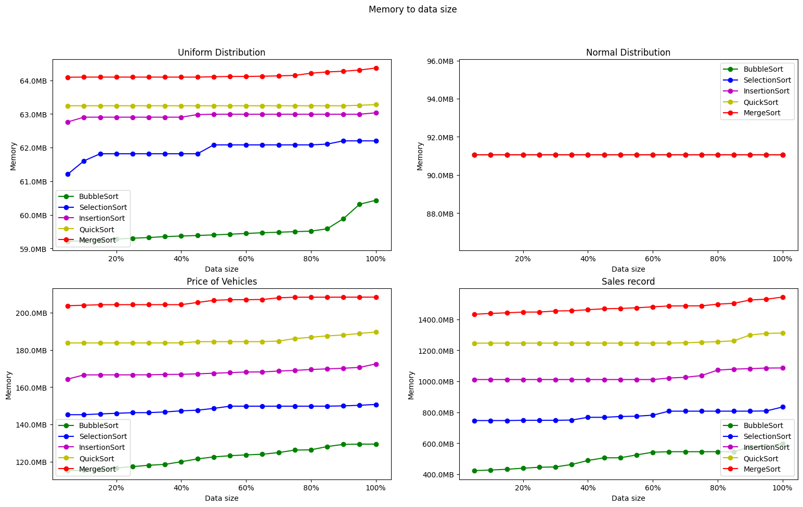
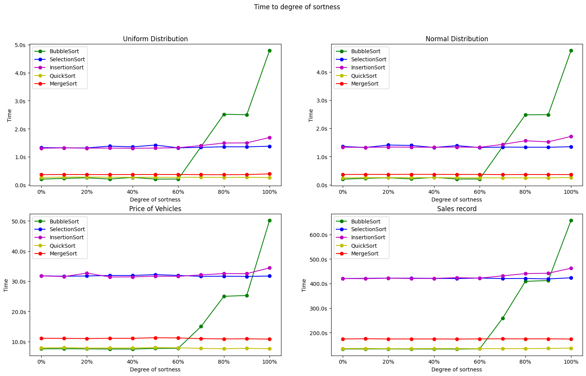
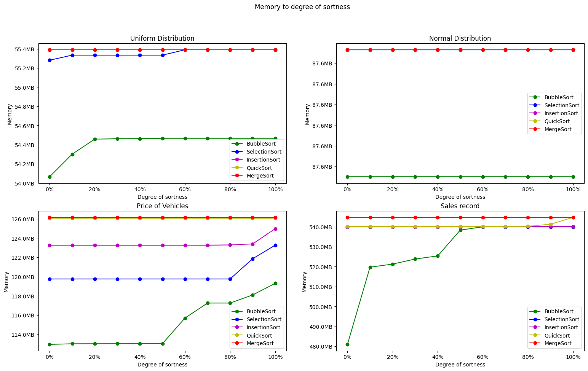

# Sorting simulation
### Execution
```dockerfile
docker-compose up -d --build
```
or
```shell
python3 -m venv venv
  && . venv/bin/activate
  && pip3 install -r requirements.txt
```

### Brief description to the sorting algorithms
#### Bubble sort
A typical in-place iterative bubble sort.
It compares the element to its next element
and performs a swap if the current element is bigger than its next element. Note that we need to perform one more full scan to confirm there is no swap and hence the array is sorted.
#### Insertion sort
An in-place recursive insertion sort. It will insert the target element to the right position by shifting all elements to the right.
#### Selection sort
An in-place recursive selection sort. It will partition the array to two section, one is the sorted part and the other is not sorted. Then it will pick the smallest element in the unsorted part of the array and put it to the tail of the sorted part.
#### Quick sort
A not in-place, recursive quick sort. It will pick the median as the pivot, and it maintains three arrays, one is for the element larger than the pivot, one is for the element smaller than the pivot, and the last one is for the element equal to the pivot. It pushes the elements of the array to these three arrays according to their arithmetic properties, and returns the concatenation of these three arrays.
#### Merge sort
A typical in-place, recursive merge sort.
It separates the array to two sections and performs the merge on both sections.

Every sort algorithm follows the same logic: First, the program partitions the data set into several portions. Each portion contains 500(based on experiments) records to avoid too many recursive calls. After sorting the given portion, the program pushes the sorted portion to an array. Finally, the program performs a k-way merge to merge the data set back to the completely sorted array.
### Time to data size sorting
Here is the graph of time to data size sorting of each of the five given sorting algorithms:

With the size of the data set growing, the time spent by the sorts grows linearly accordingly. Since the program partitions the data to units of 500 records each, it is reasonable that the time grows linearly according to the size. We can clearly see that for any given size, bubble sort always spends the most time finishing the job, providing that it has to iterate the entire portion every time it is performing the sorting process, plus one more full iteration to confirm that no swap is performed. The insertion and selection sort have similar running time, since both of them follow the divide-and-conquer approach.
For example, the self-deduction of selection sort can be expressed to the following:

where b indicates the starting point of the unsorted portion of the array.
The deduction indicates that the recursive will run on gradually growing data size unlike bubble sort, which requires a full iteration for each round.The running time of quick sort and that of merge sort is similar since they bothfollow  the  divide-and-conquer  approach. They both need to divide the array into (n/2) and perform the underlying sorting process.

### Memory to data size sorting

I used a helper class, called **MemoryMonitor** to record the memory consumption every 0.1 second, and compared the recorded number to the past peak.  It will update the peak value if the recorded memory consumption at this given moment is greater than the peak in the past.
We can clearly see that the memory consumption of the bubble sort is the lowest, since it is in iterative form.For the normal distribution, all the sorting algorithms have the same peak memory consumption,  my analysis is that the peak happens when the middle point of the distribution is being sorted.
### Definition of degree of sortness
We define the degree of sortness as the number of inversions an array contains. An inversion occurs when a larger element precedes a smaller element in an array.  For example,  [3,1,2] has two inversions:  (3,1) and (3,2). Thus, an array sorted in ascending order contains no inversions, and an array with elements sorted in descending order contains (n(n-1))/2 inversions.
### Time to degree of sortness

The x-axis represents the degree of sortness in ascending order; 100% means the array is in descending order, while 0% means the array contains no inversion.Bubble sort clearly has the worst performance as the array becomes more reversely  sorted,  since  it  requires  more  swaps  and  more  iterations  to  finish the task.<br />
For the rest of the sorting algorithms, there is no significant difference between different degree of sortness;
My implementation of insertion sort and selection sort both require to run recursive calls to the very bottom; That is, they have to run to the base case of one element no matter the degree of sortness.  The same principle applies to quick sort and merge sort as well.Note that the implementation of Quick sort did not pick the first element as the pivot, but chose the element in the middle as the pivot.  Therefore, the typical worst case of quick sort didn’t appear since the program was not able to pick the maximum and minimum when the array is in descending and ascending order, respectively.
### Memory to degree of sortness

Memory consumption has little differences due to the nature of my implementation.  Merge sort and Quick sort have the same memory consumption regardless the degree of sortness since they both have to do the recursion until the last sub-problem(i.e  when  the  input  size  is  1),  as  described  in  the  above  section. Insertion sort and selection sort are also required to do the recursion until the last sub-problem.  However, the more degree of sortness there is, the more swaps they have to perform, which would increase the memory consumption.